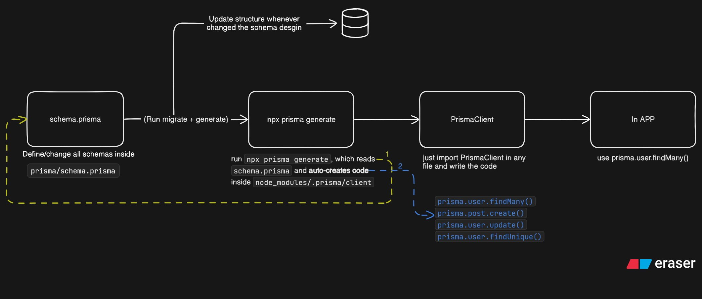

# Dev Log: Saturday, August 2, 2025

## Summary

Today, I successfully executed the first phase of the authentication system overhaul plan. The focus was on hands-on learning by setting up a foundational "proof-of-concept" project. I not only established the technical groundwork with Prisma and PostgreSQL but also created a visual diagram to map out the Prisma workflow, deepening my understanding of the tool.

---

## Key Activities & Accomplishments ✨

### 1. Executed Day 1 of the Auth Refactor Plan

* Began the hands-on learning phase by creating an isolated mini-project to serve as a learning environment, minimizing risk to the main `Expenso` codebase.
* Successfully configured and connected a Node.js application to a local **PostgreSQL** database.
* Initialized **Prisma** and set up the basic project structure for the proof-of-concept.

### 2. Visualized the Prisma Workflow

* To solidify my understanding, I created a diagram outlining the end-to-end Prisma data flow. This visual explains how changes in `schema.prisma` are compiled by `prisma generate` into the usable `PrismaClient` for the application.

---

## Git Commits (Proof-of-Concept Project) commits

* `chore: setup mini project with Prisma, PostgreSQL`

---

## Visual Aid: Prisma Workflow

---

## Plan for Tomorrow (Sunday, August 3rd) 🗓️

* Continue building out the proof-of-concept project.
* Implement the full **CRUD** (Create, Read, Update, Delete) operations for a `User` model using the Prisma client.
* Begin research on implementing the **Access and Refresh Token** logic within this new Prisma setup.
